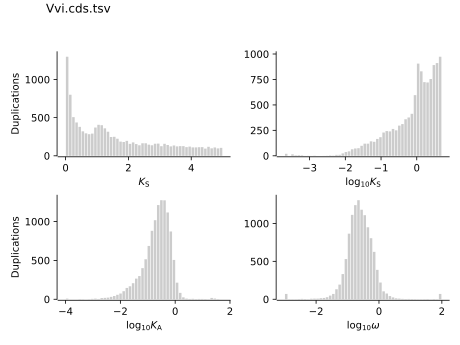
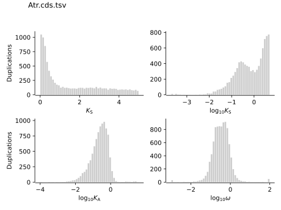
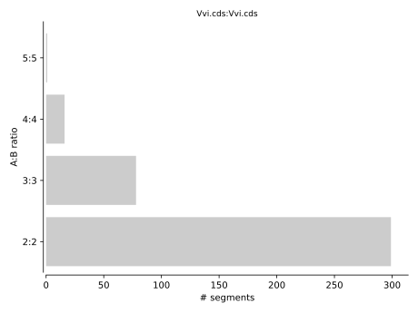
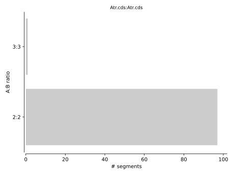

[](https://travis-ci.com/arzwa/wgd)

VIB/UGent center for plant systems biology 
[Bioinformatics & evolutionary genomics group](https://www.vandepeerlab.org/)

# `wgd` - simple command line tools for the analysis of ancient whole-genome duplications

`wgd` is a python package designed for the inference of ancient whole-genome duplication (WGD) events from genome and transcriptome assembly. This tutorial elucidates the principle and usage of `wgd`, in accordance with a chapter of a soon-to-be published book. Please refer to the book chapter for more detailed discussion and elucidation.

## Introduction

Whole genome duplication (WGD), a long-known important evolutionary force for eukaryotes, leaves its unique footprints on genome in various aspects, including the explosion of massive gene duplicates, the preservation of syntenic blocks, the burst of reconciled duplication events on certain branches in the concerned phylogenetic tree, the increase of chromosome numbers and et al. `wgd` is the program enabling users to recover such imprinting by means of deciphering the Ks distribution and synteny. We provide an exemplified workflow practice of how to detect such “WGD signature” from a given genomic dataset. We divide the practice into four steps: Step1 Installation, Step2 Data Collection and Preparation, Step3 Construction of Ks Distribution and Step4 Synteny Analysis.   

## Step 1 Installation

To install `wgd` in a virtual environment, the following command lines could be used.

```
git clone <wgd repo>
cd wgd
virtualenv -p=python3 ENV
source ENV/bin/activate
pip install requirements.txt
pip install .
```

When met with permission problem in installation, please try the following command line.

```
pip install -e .
```

If multiply versions of `wgd` were installed in the system, please add the right path of interested version into the environment variables, for example

```
export PATH="$PATH:~/.local/bin/wgd"
```

## Step 2 Data Collection and Preparation 

Since the synonymous distance Ks (the number of synonymous substitutions per synonymous site) is a feasible proxy for the age of gene duplicates (see detailed discussions in the book chapter), the protein-coding genes are exactly what we need for the construction of age distribution of whole paranome in Step 3. The gene positional information is needed for the profiling of the synteny relationship in Step4. Thus, we need the CDS (protein-coding sequences) and GFF (General Feature Format) files of interested species, here as *Vitis vinifera* and *Amborella trichopoda*, both of which are downloaded from [PLAZA](https://bioinformatics.psb.ugent.be/plaza/versions/plaza_v4_5_dicots/download/). A cleaning process for the CDS file is recommended, including: 1) only the longest transcripts are retained if alternatives are available; 2) genes with identical sequences or IDs are removed to eliminate redundancy; 3) the sequence length of CDS should be dividable by three and only contain ACGT characters while not contain any stop codons in the sequence (only at the end of sequence is allowed). The cleaned files used in subsequent analysis are in the [data](https://github.com/heche-psb/wgd/tree/dev/data) directory.

## Step 3 Construction of Ks Distribution

### Gene Family Delineation

An all-against-all protein sequence similarity search using `DIAMOND` and Markov Clustering using `MCL` are performed to delineate paralogous gene families using the following command. (Please make sure that both the program `DIAMOND` and `MCL` have been add into the environment variables)

```
wgd dmd data/Vvi.cds -I 3.0 -o data/Vvi_wgd_dmd
wgd dmd data/Atr.cds -I 3.0 -o data/Atr_wgd_dmd
```

Note that the option -I defines the inflation factor for MCL clustering, here we set an empirical 3.0. The option -e defines the e-value cut-off for similarity and here we use default e-10. We recommend the `DIAMOND` instead of the `BLAST` as the searching engine for both the time efficiency and accuracy.

After above command, we are supposed to get the paralogous gene family files [Vvi.cds.tsv](https://github.com/heche-psb/wgd/tree/dev/data/Vvi_wgd_dmd/Vvi.cds.tsv/) and [Atr.cds.tsv](https://github.com/heche-psb/wgd/tree/dev/data/Atr_wgd_dmd/Atr.cds.tsv/) for *V. vinifera* and *A. trichopoda*, respectively, each line of which represents a paralogous gene family. 

### Estimation of Ks Distance

Given the paralogous gene family information, we can start estimating the Ks distance for each pair of gene duplicates for each paralogous gene family using the following command. `PAML` is required for this step, please turn to Ziheng Yang's [lab page](http://abacus.gene.ucl.ac.uk/software/#phylogenetic-analysis-by-maximum-likelihood-paml) for detailed guidance of installation. Besides, `PAML 4.9j` works well in our test and is thereby recommended. The program `MAFFT` is required for the sequence alignment.

```
wgd ksd -n 8 --pairwise data/Vvi_wgd_dmd/Vvi.cds.tsv data/Vvi.cds -o data/Vvi_wgd_ksd
wgd ksd -n 8 --pairwise data/Atr_wgd_dmd/Atr.cds.tsv data/Atr.cds -o data/Atr_wgd_ksd
```

Note that here we set the option `--pairwise` to run `codeml` on all gene pairs separately. If `--pairwise` is not set, the aggressive algorithm built-in `codeml` would enforce all paralogs in the same family to have a single shared aligned nucleotide sequence with the removal of all gaps, resulting in a great loss of information. We recommend the set of `--pairwise` to fully exploit the information in the sequence data.





The Ks distribution of *V. vinifera* shows a considerable enrichment of gene duplicates around Ks~1, while the Ks distribution of *A. trichopoda* seems to follow the uniform/quasi-exponential mixture (see detailed discussion in the book chapter), indicating that *V. vinifera* might experience a relatively recent WGD event (or any other multiplication level for instance whole genome triplication) while *A. trichopoda* not. Such observation serves as the first piece of evidence for the inference of WGD events, which we will further seek to corroborate by the synteny analysis in step 4.

## Step 4 Synteny Analysis

The multiplication of the entire genome is supposed to instantaneously generate an additional copy of each chromosome, retaining both the gene order and gene content of the original copy. Despite chromosomal rearrangements and rampant gene loss following WGD, gene order and gene content are expected to be more or less retained on at least some chromosomes in reasonable time frames. Such chromosomal region is named *Syntenic Region*, which is assumed to be originated from the duplication of a common ancestral genomic region and considered as strong evidence for WGD once detected. A straightforward way to depict the synteny relationship within a genome is to draw a `whole-genome dotplot`, where both the x-axis and y-axis represent the same genome, and each square represents a single chromosome-to-chromosome comparison. Homologs are shown as dots while anchor pairs, defined as homologous pairs on syntenic regions, are marked in a distinct color. To delineate the synteny relationship, we use [I-ADHoRe 3.0](https://github.com/VIB-PSB/i-ADHoRe) to obtain such dotplots using the following command. 

```
wgd syn -f mRNA data/Vvi_wgd_dmd/Vvi.cds.tsv data/Vvi.gff3 -o data/Vvi_wgd_syn
wgd syn -f mRNA data/Atr_wgd_dmd/Atr.cds.tsv data/Atr.gff3 -o data/Atr_wgd_syn
```


When multiple anchors are located adjacently, a red diagonal line, reflecting a syntenic block, can be observed. We can find quite some syntenic blocks in the intragenomic dotplot of *V. vinifera* and a close examination reveals that for many chromosomal regions, we find two copies showing conserved gene order on other chromosomes, suggesting an ancestral genome triplication (hexaploidization). While for *A. trichopoda*, the anchors are negligible, implying no recent WGD.




Let's take a look at the synteny depth (or multiplication level) bar plot, in which we can find that *V. vinifera* has obviously more "level>2" synteny regions , among which the multiplication level 3 is dominant, suggesting the hexaploidization origin. While *A. trichopoda* has near-zero "level>2" synteny regions.

We perform an interspecific comparison to profile the synteny relationship between *V. vinifera* and *A. trichopoda*. The orthologous gene family is obtained by `OrthoFinder` using command:

```
orthofinder -f data/prot -t 16 -og
```

The result file [Orthogroups.tsv](https://github.com/heche-psb/wgd/tree/dev/data/Orthogroups.tsv) is what we need for next step.  
 


## Citation
 
Please cite us at https://doi.org/10.1093/bioinformatics/bty915

```
Zwaenepoel, A., and Van de Peer, Y. 
wgd - simple command line tools for theanalysis of ancient whole genome
duplications. Bioinformatics., bty915,
https://doi.org/10.1093/bioinformatics/bty915
```

For citation of the tools used in wgd, please consult the documentation at
https://wgd.readthedocs.io/en/latest/index.html#citation.

