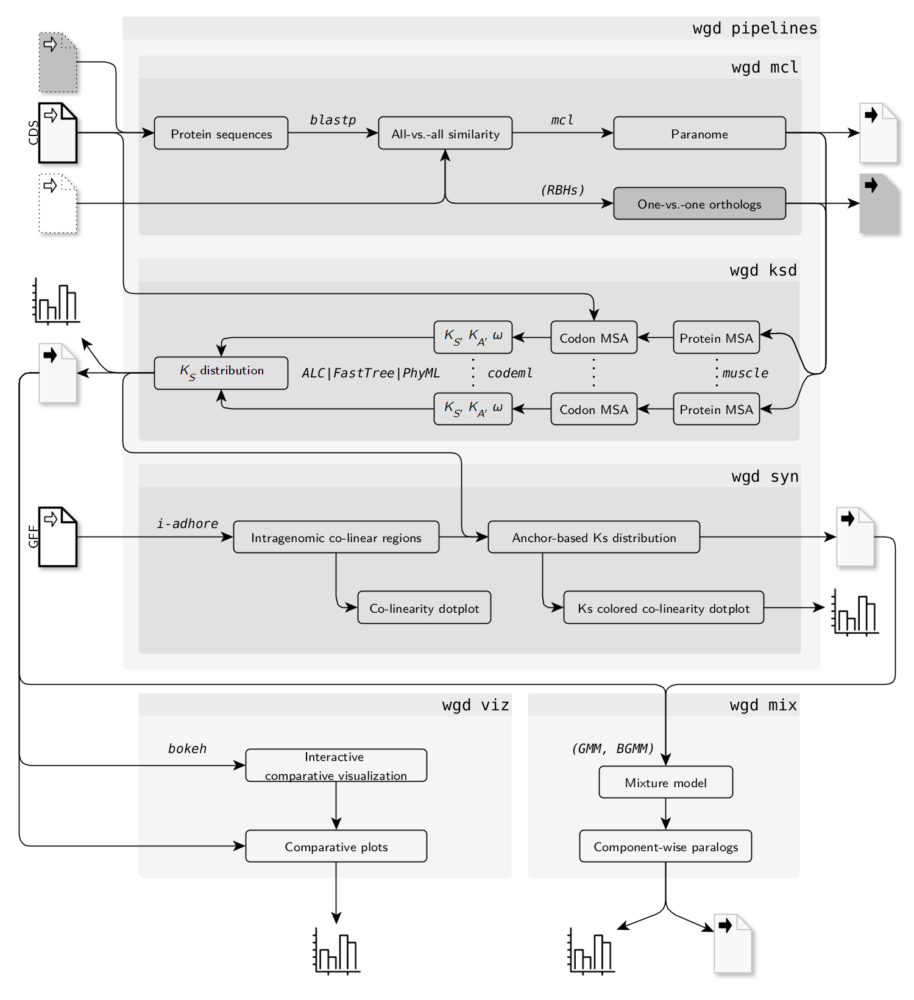

.. wgd documentation master file, created by
   sphinx-quickstart on Mon Apr 10 10:31:22 2017.
   You can adapt this file completely to your liking, but it should at least
   contain the root `toctree` directive.

wgd: Whole genome duplication analysis in Python
************************************************

This Python package and corresponding command line interface (CLI) were
developed for various analyses related to whole genome duplications (WGDs).
Here the Python API is documented as well as the various command line
utilities bundled in the ``wgd`` CLI.

To install ``wgd``, clone the repository available at
https://github.com/arzwa/wgd (where you can also find more detailed installation
instructions), navigate into the repo, run ``pip install .``.

--------------------------------------------------------------------------------

To **get started** with ``wgd`` head straight to the
:ref:`command line interface page <wgd_cli>`

--------------------------------------------------------------------------------

External software
=================

``wgd`` requires the following third party executables (preferably these should
also be in the ``PATH`` environment variable):

For ``wgd blast``:

- BLAST, from which it uses the ``blastp`` and ``makeblastdb`` commands,
  ``sudo apt-get install ncbi-blast+`` will often suffice for installation
- MCL (https://micans.org/mcl/index.html). Get MCL using your package
  manager ``sudo apt-get install mcl`` or download it at the provided link.

For ``wgd ks``:

- One of the following multiple sequence alignment programs: MUSCLE, MAFFT or
  PRANK
- CODEML from the PAML software package (Yang 1997). PAML can be downloaded
  from the following link: http://abacus.gene.ucl.ac.uk/software/paml.html
- For node weighting using phylogenetic trees, PhyML and FastTree are supported,
  but average linkage clustering (no external software needed) can be used as an
  alternative

For ``wgd syn``

- i-ADHoRe 3.0 suite (http://bioinformatics.psb.ugent.be/beg/tools/i-adhore30)

Of course, you don't need all of these tools installed for each feature of
``wgd``.

Command line tools
==================

The command line tools are the main functionality of the ``wgd`` package.
You can find tools for the following analyses:

1. All-*versus*-all Blastp analysis and MCL clustering
2. Whole paranome |Ks| (and |Ka| and ω) distribution construction
3. One-versus-one orthologs |Ks| (and |Ka| and ω;) distribution construction
4. Mixture modeling of |Ks| distributions and WGD-specific paralog extraction
5. Interactive visualization of (multiple) |Ks| distributions and kernel density
estimates thereof
6. Intragenomic co-linearity/synteny analysis and anchor based |Ks| distribution
construction
7. Co-linearity dotplot construction

All information can be found here:

.. toctree::
   :maxdepth: 1

   Command line interface <wgd_cli>

Here is a flow chart of the different analyses that can be performed using the
wgd CLI:

Python package
==============

For those interested in the underlying structure of ``wgd``, here you can find
the full documentation of the API.

Contents:

.. toctree::
   :maxdepth: 2

   Blast & Markov clustering (MCL) <blast_mcl>
   Codeml anlysis <codeml>
   Alignment tools <alignment>
   Ks distribution analysis <ks>
   Phylogenetics tools <phy>
   Mixture modeling <mix>
   Co-linearity analysis <syn>
   Utilities <utils>
   Visualization <viz>

Indices and tables
==================

* :ref:`genindex`
* :ref:`modindex`
* :ref:`search`

.. |Ks| replace:: K\ :sub:`S`
.. |Ka| replace:: K\ :sub:`A`
