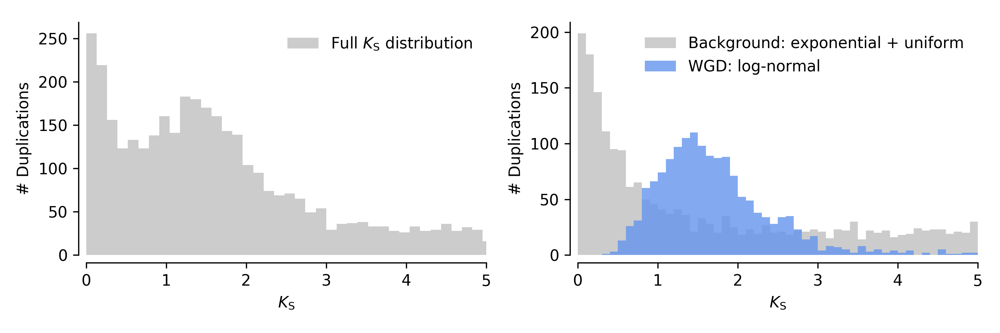
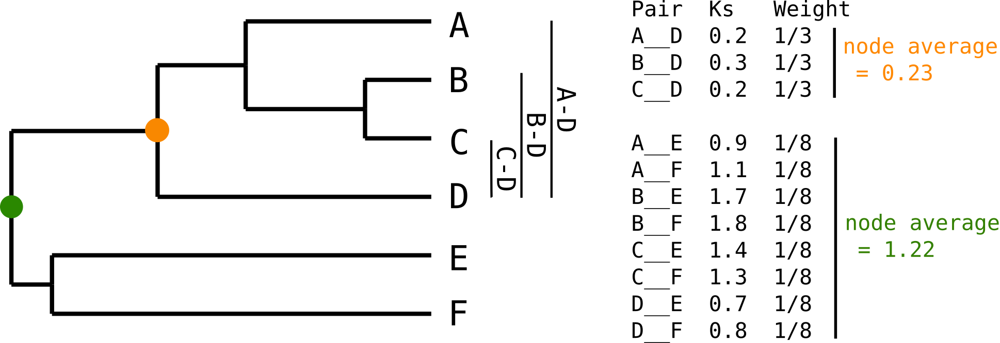

.. _methods:

==========================================================
Some informal notes on the methods implemented in ``wgd``
==========================================================

:Author: Arthur Zwaenepoel

.. contents::
   :depth: 3
..

Introduction
============

``wgd`` is a python package and command line suite for analyzing ancient whole
genome duplications (WGDs) in genomic data sets. The main focus of ``wgd`` is
on the construction of whole paranome (the collection of all duplicate genes in
a genome) |Ks| distributions, but it also provides tools for the inference of
intragenomic synteny and anchor points as well as downstream analyses and
visualizations of whole paranome |Ks| distributions. On this page we provide
some background information and informal explanations about the main functionality
and methods, namely the inference of these so-called |Ks| distributions. This
is not a tutorial on how to use ``wgd``, for that, please have a look at the
:ref:`command line interface <wgd_cli>` or at the supplementary material of 
our Bioinformatics paper.

What is a |Ks| distribution?
==============================

|Ks|, also called d\ *S*, denotes the synonymous distance between two
protein- coding DNA sequences (CDS), where synonymous distance means the
expected number of synonymous substitutions per synonymous site. A
|Ks| estimate for any two coding sequences can be acquired in two main
ways, (1) by means of heuristic counting methods such as the method of
Nei & Gojobori (1986) or (2) by using Markov models of codon
substitution with Maximum-likelihood (ML) estimation algorithms. The
latter methods are most commonly used nowadays, and trace back to the
pioneering work of Goldman & Yang (1994) and Muse & Gaut (1994). For
more information on the estimation of pairwise synonymous distances, we
refer to the wonderful textbooks on molecular evolution authored by
professor Ziheng Yang (e.g. Chapter 2 in Yang 2006).

Since synonymous substitutions are presumed to have largely negligible
effects on fitness, they are commonly regarded as neutral. Therefore we
expect the synonymous distance between two protein coding sequences to
increase with time in a stochasti clock like fashion. It is therefore
assumed that |Ks| can serve as a proxy for time, and that a larger
|Ks| value indicates an older divergence time between two sequences.

A whole paranome |Ks| distribution is nothing more than the
distribution of all |Ks| estimates for all inferred duplication events
in the genome of some species. It therefore serves as a proxy for the
distribution of the divergence times of all duplication events that have
left a trace in the genome of interest. Under the assumption of a
constant gene duplication rate and a constant rate of loss of duplicated
copies, such a distribution is expected to show an exponential decay
shape (Lynch & Conery 2000, Lynch 2007), which is the result of a quasi-
equilibrium linear birth-death process. A WGD event entails the
duplication of all gene copies in the genome at some point in time
(*i.e.* the polyploidization event) and subsequent massive loss or
divergence of duplicated copies in a relatively short time frame (*i.e.*
the rediploidization phase). This process of WGD followed by
rediploidization is expected to leave a large number of duplication
events with similar divergence times (and hence similar |Ks| values)
that can be traced back in the extant genome of interest. As a result a
WGD is expected to leave a peak signature in the |Ks| distribution
that cannot be explained by constant rate small-scale duplication as in
the model of Lynch & Conery.

As a side note, we note that if we assume synonymous substitution is a Poisson
process, and the synonymous substitution rate is Gamma distributed across gene
families, this WGD peak signature is expected to follow a negative binomial
distribution in the ditribution of numbers of synonymous substititions (which
is not the same as |Ks| distribution).  In the |Ks| distribution, this would
translate to a peak which has a distribution with positive skew, which we could
approximate by a Gamma or Log-Normal distribution. These considerations are
important for mixture modeling. An *ad hoc* illustration of such a hypothetical
|Ks| distribution is shown below. The left plot shows the full |Ks| distribution,
whereas the right plot shows the decomposition into the background signature from
the continuous birth, death and fixation of small-scale duplicates (gray) and the
WGD signature (in blue, here modeled as a log-normal distribution).

How is the |Ks| distribution computed in ``wgd``?
===================================================

While the basic idea seems simple enough, constructing a |Ks|
distribution is a rather involved business. This is the main reason why
we released ``wgd``, to make this seemingly simple approach actually
simple to perform. Below we elaborate on the main steps undertken in a
|Ks| distribution construction.

Inferring duplicates
--------------------

First, we need to infer the duplicate genes in the genome. To this end,
commonly employed homolog clustering approaches are used in ``wgd mcl``.
Since we are however not interested in multi-species gene families,
these homolog clustering methods are used only within a particular
genome of interest. ``wgd mcl`` clusters genes into paralogous families
(where all genes are paralogous to each other, *i.e.* diverged after
some duplication event) by

1. Doing an all-\ *versus*-all Blastp similarity search
2. Constructing a sequence similarity graph based on the Blastp results
3. Finding clusters in the graph by means of an unsupervised approach
   using the Markov Clustering algorithm (MCL, Vandongen 2000).

For more information on these approaches, please consult literature on
homolog clustering (e.g. OrthoMCL, OrthoFinder), but bear in mind that
we are only concerned with within genome homolog clusters, *i.e.*
paralogous gene families.

Calculating *pairwise* Ks values
--------------------------------

For every paralogous family we inferred, we first construct a multiple
sequence alignment (MSA) using standard practices (in ``wgd ksd`` you
can choose between MUSCLE, MAFFT and PRANK for alignment). Alignments
are constructed at the amino acid level as these can be more reliable,
and are backtranslated to nucleotide sequences to obtain a
codon-alignment.

Now that we have our paralogous gene families and MSAs, we can compute
for every pair in the family the synonymous distance, |Ks|. To this
end ``wgd ksd`` uses the ``codeml`` program from the PAML package.
``codeml`` has tons of parameter settings and algorithmic options, and
those used in ``wgd ksd`` will not be reiterated here but can be found
in the supplement to Zwaenepoel & Van de Peer (2018) or Vanneste *et
al.* (2013). In general, the settings are set such that they do a good
job at estimating pairwise |Ks| values reliably by maximum likelihood.

Calculating Ks estimates for duplication *events*
-------------------------------------------------

Note that after the previous step step we have n(n-1)/2 pairwise |Ks|
estimates for a paralogous family with n genes, whereas what we really
want is Ks estimate for each *duplication event* in the family. If
multiple duplications happened, we will have multiple redundant |Ks|
estimates for internal duplication nodes in the gene family tree. To see
this, have a look at the figure below, where a paralogous gene tree is
shown, with two marked internal duplication nodes and their respective
|Ks| values.

We are interested in the divergence time (approximated by |Ks|) for the five
internal nodes of this tree, whereas what we really have is 6x5/2= 15 |Ks|
estimates between all pairs of leaves. As is clear from this figure, we have 3
redundant estimates for the orange node, whereas we have 8 redundant estimates
for the green node.  We can correct for this redundancy by either averaging
|Ks| values for each node (or taking some other summary statistic like the
median), or by computing a weight for every |Ks| value. (see also next section).

However, to do this we of course need the tree, therefore ``wgd ksd`` will
compute for every paralogous gene family a phylogenetic tree after calculating
the pairwise |Ks| values to do redundancy correction (either by node-averaging
or node-weighting, see below). In ``wgd ksd`` one can choose between three
options to construct this tree, either average linkage clustering of |Ks|
values (which is fast but somewhat crude), approximate ML tree inference using
FastTree (Price *et al.*) or ML tree inference using PhyML (which is obviously
the slowest option).

After the tree is computed ``wgd ksd`` will write for every pair the Ks
estimate, some alignment statistics, the node in the tree for which the Ks
value provides a divergence estimate, the gene family, the various distance
estimates (|Ks|, |Ka| and ω) and the weights computed without filtering out
outliers and with filtering out outliers (see below).

Visualizing a |Ks| distribution
===============================

If all goes well, ``wgd ksd`` will compute a |Ks| distribution which looks
somewhat like this (where I have omitted lots of columns that are not really
of interest currently)::

    	                        Family	    Ks         Node     WeightOutliersExcluded
    AT3G11180__AT5G05600	GF_000093   0.7679     23.0     1.00
    AT2G38240__AT5G05600	GF_000093   1.9122     25.0     0.33
    AT2G38240__AT3G11180	GF_000093   2.5219     25.0     0.33
    AT5G08640__AT5G63580	GF_000093   1.3265     30.0     0.20
    ...                         ...

Now, simply plotting a histogram of the resulting |Ks| values will of course be
flawed, since we will plot all redundant estimates with equal weight, and since
older duplication events will have more pairwise estimates, this may
artificially amplify the signal of old duplication events. 

There are two main approaches to overcome this, already noted in the previous
section. The first is **node-averaging**, where one computes a summarized |Ks|
value for each node. This is easily performed using built-in functions to work
with data frames in R or Python. This approach obviously throws away the
information in the individual pairwise estimates and only uses the summarized
value in subsequent analysis. The second approach is **node-weighting**, where
one computes a weight for every pairwise estimate, and adds every single
estimate to the histogram but with some weighted based on the number of
redundant etimates.  Such an approach does not throw away the information in
individual estimates, but is trickier to work with in subsequent analyses such
as Kernel density estimation (KDE) or Gaussian mixture modeling (GMMs).
Weighted histograms can be plotted both in ``ggplot2`` in R and ``matplotlib``
in Python.

It is important to be aware that different filters on the |Ks| range, will
cause the weights to change. Indeed, if some pairwise estimate is filtered out,
because of some filtering riterion, the number of |Ks| estimates will change
for that particular duplication event. This is exactly the difference between
the `WeightOutliersIncluded` column and `WeightOutliersExcluded` column, where
the weights in the latter column are based on the number of pairwise estimates
after filtering, whereas the former has weights based on the number of pairwise
estimates before filtering. It is does important to recompute the weights when 
different filtering riteria are used. The tools in ``wgd`` will always do this,
but it is important to keep in mind when analyzing the dat yourelf in R or some
other statistical/plotting environment.

Note that ``wgd ksd`` by default outputs node-weighted histograms, whereas
node-averaged histograms can be generated using ``wgd viz``. The mixture
modeling and KDE methods in ``wgd mix`` and ``wgd kde`` use node-averaged
histograms for modeling purposes.

Downstream analyses
===================

Downstream analyses consist mainly of fitting different models to a |Ks| 
distribution, which could be KDEs, or mixture models. For more information
on mixture modeling of |Ks| distributions, we refer to :ref:`note_on_gmms`.

.. |Ks| replace:: `K`\ :sub:`S`
.. |Ka| replace:: `K`\ :sub:`A`
