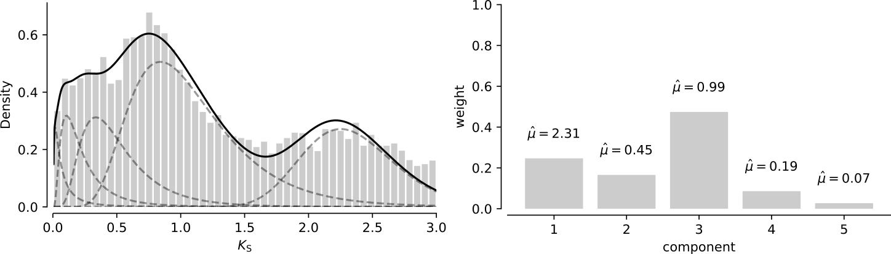

Mixture modeling
****************

The mixture modeling features of `wgd` use the ``sci-kit learn``
(better known as ``sklearn`` library).

.. _note_on_gmms:

A note on mixture models for |Ks| distributions
===============================================

Mixture models have been employed frequently to study WGDs with |Ks|
distributions. Under several basic molecular evolutionary assumptions, the peak
in the |Ks| distribution caused by a WGD is expected to show an approximate gamma
distribution, which is well approximated by a log-normal distribution. Fitting
mixtures of log-normal components and statistical evaluation of different model
fits is therefore a reasonable strategy to locate WGD-derived peaks in a |Ks|
distribution.

However, mixture models are known to be prone to overfitting, and this is
especially true for |Ks| distributions where we have a lot of data points (see
e.g. Tiley `et al.` (2018) for a recent study on mixture models for WGD inference).
Therefore, we do not advise to use mixture models as formal statistical tests
of multiple WGD hypotheses. We mainly regard mixture models as providing a
formal visualization of what a researcher understands as a 'peak' giving
evidence for a WGD. Additionaly, mixture models allow to obtain an estimate for
the mean and variance of hypothesized WGD peaks. Also, mixture models allow a
means of selecting paralogous pairs that are derived from a hypothesized WGD
using quantitative measures. That is, given a fitted mixture model which we
regard as representing our hypothesis of ancient WGDs, we can isolate those
gene pairs that belong with 95% probability to the component under the model.
This is of course a preferable approach compared to applying arbitrary cut-offs
based on visual inspection.

A note on the practical difference between the BGMM and GMM method
==================================================================

For algorithmic and theoretical details, we refer to
http://scikit-learn.org/stable/modules/classes.html#module-sklearn.mixture. Here
we give a pragmatic description. Again we stress that mixture modeling results
should not be taken as evidence for WGD as such, and should also be interpreted
with caution (see above)!

The GMM method
--------------

When using the GMM method, model selection proceeds by evaluating relative model
fit using the Bayesian or Akaike information criterion ([B/A]IC). Comparison of
AIC values across models can be used to assess which model fits the data best
according to the AIC. As an example, consider the output of ``wgd mix``::

    AIC assessment:
    min(AIC) = 25247.22 for model 4
    Relative probabilities compared to model 4:
        /                          \
        |      (min(AIC) - AICi)/2 |
        | p = e                    |
        \                          /
    .. model   1: p = 0.0000
    .. model   2: p = 0.0000
    .. model   3: p = 0.0000
    .. model   4: p = 1.0000
    .. model   5: p = 0.0005

The `p` computed by the formula shown in this output can be interpreted as
proportional to the probability that model i minimizes the information loss.
More specifically in this example, model 5 is 0.0005 as probable to minimize the
expected information loss as model 4. In this case the AIC clearly supports the
4 component model.

The BIC based model selection procedure is analogous. For every model fit we
calculate the BIC value and we record the difference with the minimum BIC value
(this is the Delta BIC value). If we interpret Delta BIC values as Bayes factors,
we can again perform model selection::

    Delta BIC assessment:
    min(BIC) = 25327.22 for model 4
    .. model   1: delta(BIC) =  3970.57 (    >10: Very Strong)
    .. model   2: delta(BIC) =  1758.68 (    >10: Very Strong)
    .. model   3: delta(BIC) =    38.39 (    >10: Very Strong)
    .. model   4: delta(BIC) =     0.00 (0 to  2:   Very weak)
    .. model   5: delta(BIC) =    37.17 (    >10: Very Strong)

Where ``(    >10: Very Strong)`` denotes very strong support of model 4 over
another model. These results confirm the results of the AIC values.

The BGMM Method
---------------

The BGMM method uses a variational Bayes algorithm where a prior distribution
on the component weights can be used to perform regularization. That is, for
particular choices of the hyperparameter governing the prior distribution
(denoted as gamma), the model fitting procedure will allow more or less components
to be active in the mixture. For low values of gamma, the model fitting procedure
effectively penalizes the number of high weight components in the mixture. In
other words, this approach has some degree of built-in model selection. In `wgd`
we provide plots of the mixture with associated weights for each component such
that the user can visually discern whether some component is active (high weight)
or inactive (low weight) in the mixture.

For example, using the same distribution as in the previous paragraph, a mixture
with 5 components looks like this:

Here we clearly see that the fifth component with mean 0.07 has negligible weight
compared to the other components in the mixture, which agrees with the results
from above.

Reference
=========

.. automodule:: wgd.modeling
    :members:
    :private-members:
    :special-members: __init__

.. |Ks| replace:: K\ :sub:`S`
.. |Ka| replace:: K\ :sub:`A`
