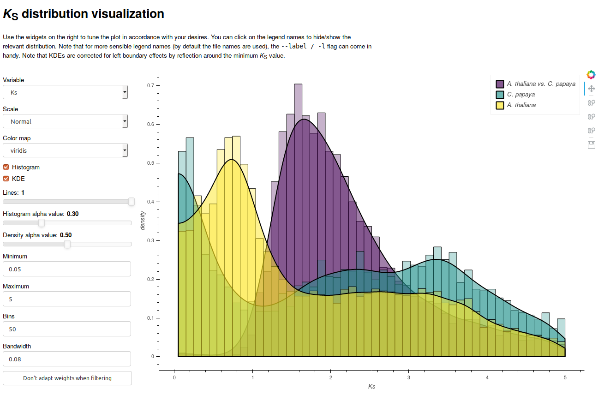

.. _viz_info:

Visualization module
********************

The visualization module allows both interactive visualization using bokeh, as
well as generating static image files. Below a screenshot of the interactive
interface is included:

The interactive interface allows modification of key parameters, such as the
histogram bin-width and KDE bandwidth. You are strongly encouraged to observe
the effects of modifications in these parameters, as they may reveal
visualization artifacts. As one can see from the screenshot, it allows
overlaying multiple distributions, overlaying histograms and KDEs, and
dynamically hiding and showing of distributions (by clicking the entries in the
legend). Note that to run the interactive visualization, a bokeh server should
be running, which you can initiate with the following command::

    bokeh serve &

Note that ``bokeh`` should be installed automatically when installing ``wgd``.

Alternatively, the ``viz`` module also allows generating static images when the
``--interactive`` flag is not set.

A note on histogram visualization
=================================

|Ks| distributions can be visualized in three main ways, (1) a pairwise |Ks|
value histogram, (2) a node-averaged histogram and (3) a node-weighted histogram.

In the first case all pairwise estimates are added with equal weight to the
distribution, however, more ancient duplications will therefore end up in the
|Ks| distribution with multiple estimates. Such a representation is thus rather
flawed, as it will artifically amplify peaks in high |Ks| regions because there
are simply more estimates for older duplication events. This representation is
not used in ``wgd``, however it can be simply generated by simply plotting the
|Ks| column of the tsv output from ``wgd ksd`` in R or Python.

Node-averaging addresses this problem by averaging |Ks| estimates for a particular
duplication node in a gene family tree. This is the default distribution used for
modeling purposes such as **mixture modeling and KDEs**.

Node-weighted |Ks| values use the same principle as node averaging, but keep the
original values. Instead of plotting a histogram of averages for all nodes, a
histogram is plotted where every |Ks| estimate for a particular duplication node
is added with equal weight such that the weights of all estimates for that node
sum up to one. Since this is arguably the representation closest to the actual
data, this is the default output when running ``wgd ksd``. They can also be
plotted using the ``--weighted`` flag in ``wgd viz``.

Another subtle point is whether the weights or averages are computed before or
after filtering steps are applied. By default ``wgd`` employs a strategy where
weights or averages are computed `after` filtering, effectively designating the
filtered values as outliers. The ``wgd viz`` tool gives the option to look at the
effect of calculating averages before filtering.

Reference
=========

.. automodule:: wgd.viz
    :members:
    :private-members:
    :special-members: __init__

.. |Ks| replace:: K\ :sub:`S`
.. |Ka| replace:: K\ :sub:`A`
